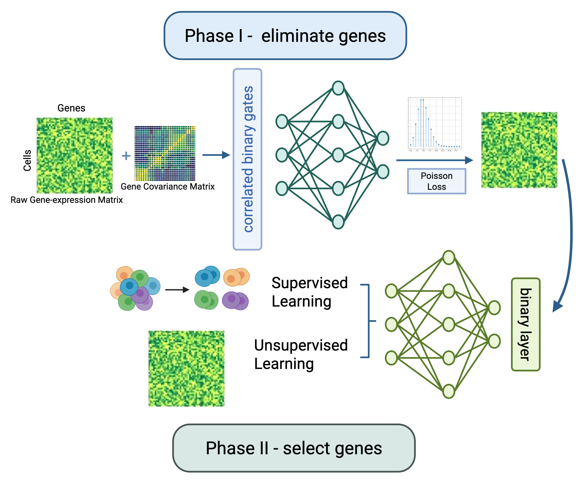

# scGPD: Single-cell informed Gene Panel Design for Targeted Spatial Transcriptomics

**scGPD** is a deep learning framework for designing compact and informative gene panels for targeted spatial transcriptomics experiments, using single-cell RNA-seq data as a reference.  
It explicitly models gene–gene correlations and performs two-stage feature selection to produce non-redundant, task-adaptive gene panels.

---

## Workflow

The **scGPD** framework implements a **dual-stage gene selection paradigm** for identifying informative genetic markers from single-cell RNA-seq data.

<p align="center">
  
</p>

In the first stage, scGPD aims to reconstruct the original scRNA-seq gene expression levels.  
A correlation-aware binary gating mechanism is employed to eliminate redundant and uninformative genes by learning interdependent feature activations, thereby producing a reduced candidate gene pool.

In the second stage, application-specific loss functions guide the selection of exactly k genes from the reduced pool of d candidates.  
This is achieved by applying a binary mask to the model inputs, resulting in a fixed-size gene panel optimized for the downstream task.

Overall, this two-stage design enables scGPD to produce compact, non-redundant gene panels that are directly compatible with targeted spatial transcriptomics assays.

## Installation

You can install the package by cloning the repository and pip installing it as follows:

```bash
pip install -e .
```
# Tutorials

Please use the file **tutorial.ipynb** as a tutorial for running our method.The demo dataset can be found in [this folder](https://drive.google.com/drive/folders/1yA-ccARb4CuMdN-EtGUyW8esp4I4Orsu?usp=drive_link).
