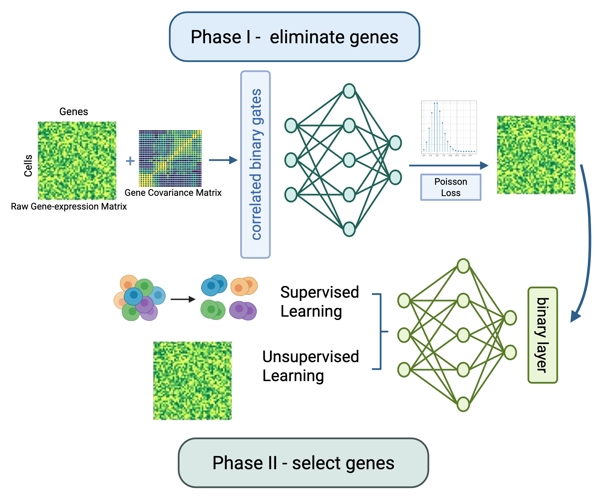

# scGPD: Single-cell informed Gene Panel Design for Targeted Spatial Transcriptomics

**scGPD** is a deep learning framework for designing compact and informative gene panels for targeted spatial transcriptomics experiments, using single-cell RNA-seq data as a reference.  
It explicitly models gene–gene correlations and performs two-stage feature selection to produce non-redundant, task-adaptive gene panels.

---

## Workflow

The **scGPD** framework implements a **dual-stage gene selection paradigm** for identifying informative genetic markers from single-cell RNA-seq data.

<p align="center">
  
</p>

In the first stage, scGPD aims to reconstruct the original scRNA-seq gene expression levels.  
A correlation-aware binary gating mechanism is employed to eliminate redundant and uninformative genes by learning interdependent feature activations, thereby producing a reduced candidate gene pool.

In the second stage, application-specific loss functions guide the selection of exactly k genes from the reduced pool of d candidates.  
This is achieved by applying a binary mask to the model inputs, resulting in a fixed-size gene panel optimized for the downstream task.

Overall, this two-stage design enables scGPD to produce compact, non-redundant gene panels that are directly compatible with targeted spatial transcriptomics assays.

## Installation

You can install the package by cloning the repository and pip installing it as follows:

```bash
pip install -e .
```
# Tutorials

We provide a step-by-step tutorial in:

`tutorial.ipynb`

The notebook contains detailed explanations of the entire scGPD workflow, including:

- Data preprocessing for single-cell RNA-seq input  
- Stage I: Correlation-aware candidate gene selection  
- Stage II: Fixed-size task-adaptive gene panel optimization  
- Model training and hyperparameter configuration  
- Extracting and interpreting the final gene panel  

Each step is clearly documented with explanatory comments to help users understand both the implementation details and the methodological rationale.

The dataset used in the tutorial can be downloaded from [this folder](https://drive.google.com/drive/folders/1yA-ccARb4CuMdN-EtGUyW8esp4I4Orsu?usp=drive_link).

After downloading, please follow the directory structure described in the notebook.

# Experiments & Reproducibility

All experiment scripts used to generate the results reported in the manuscript are provided in the `experiments_code` folder.

Each script corresponds to a specific dataset analyzed in the paper. All datasets used in the manuscript are publicly available. We also provide direct download links in each script. All quantitative results in the manuscript can be reproduced by running the corresponding experiment scripts. 

In our experiments, the gene–gene covariance matrix is estimated using CS-CORE (Su et al., 2023).

Tutorial and implementation of CS-CORE:
https://github.com/ChangSuBiostats/CS-CORE

Please note that scGPD does not depend on a specific covariance estimator. CS-CORE is used in our experiments due to its robustness for single-cell RNA-seq data; however, any reasonable gene–gene covariance or correlation estimator can be used in place of CS-CORE. Users may substitute alternative covariance estimation methods depending on their data characteristics or research preferences.


